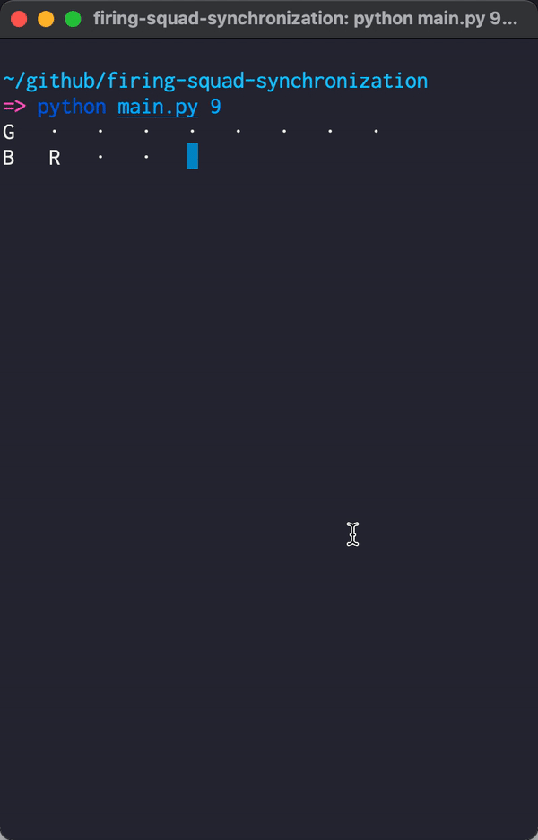
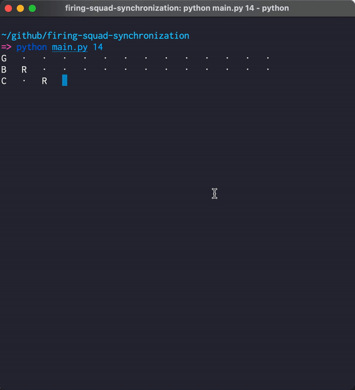

[Firing squad synchronization problem](https://en.wikipedia.org/wiki/Firing_squad_synchronization_problem)
15-states solution in Python.

References:

* https://en.wikipedia.org/wiki/Firing_squad_synchronization_problem
* https://www.youtube.com/watch?v=9swgG1Nmurg

15 States:

* I - Idle.
* G - General
* L - Hand left.
* R - Hand right.
* A - Leg right at step 1st.
* B - Leg right at step 2nd
* C - Leg right at step 3rd.
* a - Leg left at step 1st.
* b - Leg left at step 2nd
* c - Leg left at step 3rd.
* bB - Both leg left and right at step 2nd.
* cC - Both leg left and right at step 3rd.
* RL - Hands inward.
* LR - Hands outward.
* F - Fire.

